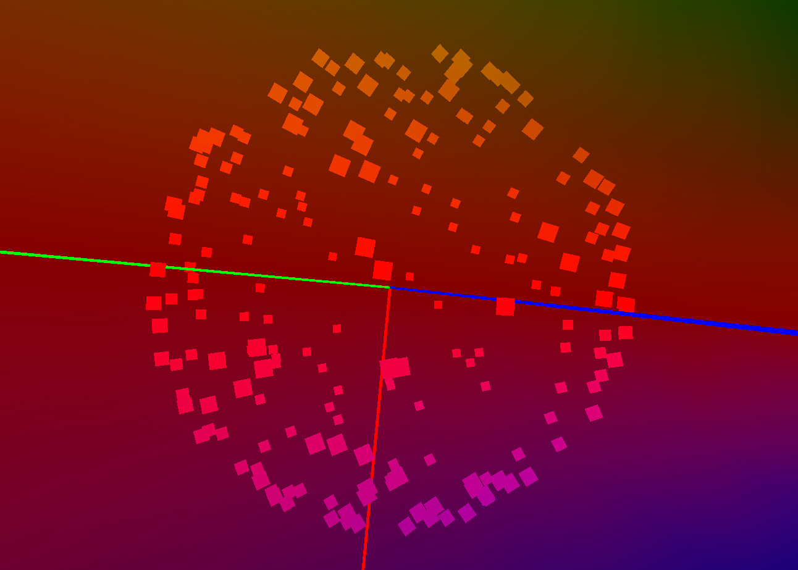

# Continuous Vector Field on Sphere with One Pole

 * Continuous Tangent Vector Field on Sphere
   * Only One Pole
   * Based on Hair Ball Theorem [1]

## References
1. [Hairy Ball Theorem](http://en.wikipedia.org/wiki/Hairy_ball_theorem), Wikipedia
